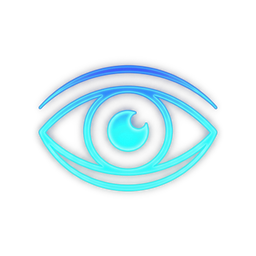

# EYES CARE

**Professional Offline Eye-Care, Screen-Protection, Break-Management, and Background Productivity Utility for Windows 10 & 11**



[](https://opensource.org/licenses/MIT)
[](https://www.microsoft.com/windows)
[](https://www.electronjs.org/)
[](https://github.com/infovirtuspk-png/Eyes-Care)

---

## Table of Contents

- [Overview](#overview)
- [Key Features](#key-features)
- [Screenshots](#screenshots)
- [System Requirements](#system-requirements)
- [Installation](#installation)
- [Quick Start](#quick-start)
- [Global Hotkeys](#global-hotkeys)
- [Configuration](#configuration)
- [Architecture](#architecture)
- [Development](#development)
- [Building](#building)
- [Troubleshooting](#troubleshooting)
- [Contributing](#contributing)
- [License & Privacy](#license--privacy)
- [Support](#support)

---

## Overview

Eyes Care is a comprehensive desktop application designed to protect your eyes and enhance productivity during long computer sessions. It combines advanced display control, automated break management, and focus tools into a single, 100% offline application that respects your privacy.

---

## Key Features

- **Real Windows Display Control**:
  - Color temperature calibration from **1000K to 10000K** using GDI `SetDeviceGammaRamp` RGB curve transformations.
  - Smooth hardware (WMI) and software gamma brightness adjustments (0% to 100%).
  - 8 Built-in Presets: **Pause**, **Health**, **Game**, **Movie**, **Office**, **Editing**, **Reading**, **Custom**.
- **Automated Day / Night Transitions**:
  - Smooth circadian day-to-night transitions (Day: 6500K / 100% $\to$ Night: 3500K / 70%).
  - Multi-schedule manager supporting custom schedules with weekday/weekend filtering and priority.
- **Break Management Engine**:
  - **20-20-20 Rule**, **Pomodoro (25m/5m)**, **Standard (50m/10m)**, and **Custom** intervals.
  - Multi-monitor full-screen Break Lock Screen with countdown and eye-relaxation instructions.
  - Smart Inactivity Pause via native Win32 `GetLastInputInfo` idle detection.
- **Focus & Reading Tools**:
  - **Reading Ruler** horizontal band following cursor.
  - **Spotlight** circular clear region with dimmed surroundings.
  - **Focus Blur** for reducing peripheral glare and visual distraction.
- **MagicX Window Enhancement**:
  - Floating desktop toolbar with **Dark Invert**, **Grayscale**, **Night Dim**, and **Restore** shaders.
- **Application-Specific Rule Engine**:
  - Automatically matches foreground Windows processes (e.g. `chrome.exe`, `photoshop.exe`, `code.exe`) and applies corresponding profiles.
- **Developer & Diagnostic Backend Terminal**:
  - Dedicated 900×550 diagnostic console with real-time log streaming (INFO, SUCCESS, WARN, ERROR, DEBUG), log filtering, search, export, and subsystem health indicators.
- **100% Offline-First Architecture**:
  - Zero external servers, cloud databases, or remote tracking.
  - Local persistence using SQLite (`sql.js`), stored in `%LOCALAPPDATA%\Eyes Care\eyescare.db`.
  - JSON settings export and import with schema validation.
- **System Tray & Windows Startup**:
  - Background execution with full interactive context menu.
  - Windows boot auto-launch with silent background startup.

---

## Screenshots

### Main Interface
*Professional dashboard with real-time controls for brightness, temperature, and scheduling*

### Break Lock Screen
*Full-screen break overlay with countdown timer and eye-relaxation exercises*

### MagicX Toolbar
*Floating desktop toolbar with instant access to color transformations*

### Developer Console
*Built-in diagnostic terminal with real-time system monitoring*

---

## System Requirements

### Minimum Requirements
- **OS**: Windows 10 (Version 1809 or later) / Windows 11
- **RAM**: 4 GB
- **Storage**: 100 MB free space
- **Display**: Compatible with standard Windows display drivers

### Recommended Requirements
- **OS**: Windows 11
- **RAM**: 8 GB
- **Storage**: 200 MB free space
- **Display**: Multi-monitor setup supported

---

## Installation

### Method 1: Download Installer (Recommended)
1. Download the latest installer from the [Releases](https://github.com/infovirtuspk-png/Eyes-Care/releases) page
2. Run `Eyes-Care-Setup-1.0.0-x64.exe`
3. Follow the installation wizard
4. Launch from Start Menu or Desktop shortcut

### Method 2: Portable Version
1. Download `Eyes-Care-Portable-1.0.0.exe` from [Releases](https://github.com/infovirtuspk-png/Eyes-Care/releases)
2. Run directly without installation (no admin rights required)
3. Place in any folder or USB drive

### Method 3: Build from Source
See [Development](#development) section below

---

## Quick Start

1. **Launch the Application** - Double-click the Eyes Care icon
2. **Choose a Preset** - Select from Health, Office, Reading, Game, or Custom modes
3. **Enable Automation** - Set up day/night schedules and break reminders
4. **Customize Hotkeys** - Use global shortcuts for quick adjustments
5. **Enable Startup** - Configure Windows boot auto-launch for continuous protection

---

## Tech Stack

- **Framework**: Electron (Node.js)
- **Frontend**: Vanilla HTML5 / CSS3 / JavaScript (Dark Charcoal `#17191B`, Cyan/Teal `#00CED1` accent)
- **Database**: SQLite (`sql.js`) with migrations
- **Display Layer**: Windows GDI (`SetDeviceGammaRamp`), WMI (`WmiMonitorBrightnessMethods`), Win32 `GetLastInputInfo`, `ProcessMonitor`
- **Security**: `contextIsolation: true`, `nodeIntegration: false`, strict allowlisted IPC bridge

---

## Global Hotkeys

| Shortcut | Action |
|---|---|
| `Alt+Up` | Increase Brightness (+5%) |
| `Alt+Down` | Decrease Brightness (-5%) |
| `Alt+Right` | Increase Temperature (+500K) |
| `Alt+Left` | Decrease Temperature (-500K) |
| `Alt+B` | Take Break Now |
| `Alt+P` | Pause Eye Protection (Reset) |
| `Alt+F` | Toggle Focus Overlay |
| `Alt+M` | Toggle MagicX Toolbar |
| `Alt+1` | Health Mode (4000K / 80%) |
| `Alt+2` | Office Mode (5000K / 85%) |
| `Alt+3` | Reading Mode (3500K / 70%) |
| `Alt+4` | Game Mode (6000K / 100%) |

---

## Configuration

### Settings Location
All settings are stored locally in:
```
%LOCALAPPDATA%\Eyes Care\eyescare.db
```

### Export/Import Settings
- Go to Settings → Backup & Restore
- Export your configuration as JSON
- Import settings on different machines

### Profile Customization
- Create custom brightness/temperature profiles
- Define application-specific rules
- Set up personalized break schedules

---

## Architecture

### Project Structure
```
Eyes Care/
├── src/
│   ├── main/           # Electron main process
│   │   ├── main.js     # Application entry point
│   │   ├── window.js   # Window management
│   │   ├── ipc/        # IPC handlers
│   │   └── database/   # SQLite operations
│   └── renderer/       # UI rendering
│       ├── index.html  # Main interface
│       ├── css/        # Stylesheets
│       ├── js/         # Frontend logic
│       └── assets/     # Icons and resources
├── tests/              # Test suite
├── scripts/            # Build scripts
├── docs/               # Documentation
└── package.json        # Project configuration
```

### Key Components
- **Display Controller**: GDI gamma ramp manipulation
- **Schedule Engine**: Time-based profile switching
- **Break Manager**: 20-20-20 rule enforcement
- **Process Monitor**: Application-specific profile matching
- **Focus Overlay**: Visual concentration tools

### Security Features
- Context isolation enabled
- Node integration disabled
- Strict IPC bridge allowlist
- No external network requests
- Local data storage only

---

## Development

### Prerequisites
- Node.js 14.x or higher
- npm 6.x or higher
- Git

### Setup Development Environment
```bash
# Clone the repository
git clone https://github.com/infovirtuspk-png/Eyes-Care.git
cd Eyes-Care

# Install dependencies
npm install

# Run in development mode
npm run dev
```

### Running Tests
```bash
# Run automated test suite
node tests/test-suite.js
```

### Project Scripts
- `npm start` - Launch application
- `npm run dev` - Launch with development tools
- `npm run build` - Build for current platform
- `npm run build:win` - Build Windows installer
- `npm run build:portable` - Build portable executable

---

## Building

### Build Process
```bash
# Build Windows installer (NSIS)
npm run build:win

# Build portable executable
npm run build:portable

# Output location
dist/Eyes-Care-Setup-1.0.0-x64.exe
dist/Eyes-Care-Portable-1.0.0.exe
```

### Build Configuration
Build settings are configured in `electron-builder.yml`:
- Installer with custom directory selection
- Desktop and Start Menu shortcuts
- Digital signature support (configure your certificate)
- ASAR packaging for security

---

## Troubleshooting

### Common Issues

**Application won't start**
- Ensure Windows 10/11 is updated
- Check antivirus settings
- Run as administrator if needed

**Display changes not applying**
- Verify graphics driver is up to date
- Check if other overlay software is running
- Try different preset profiles

**Break reminders not working**
- Ensure inactivity detection is enabled
- Check system power settings (sleep mode)
- Verify notification permissions

**Hotkeys not responding**
- Check for conflicting applications
- Ensure Eyes Care is running in background
- Try different key combinations

### Getting Help
- Check [TROUBLESHOOTING.md](TROUBLESHOOTING.md) for detailed solutions
- Review [WINDOWS-DISPLAY.md](WINDOWS-DISPLAY.md) for display issues
- Open the built-in Developer Console for diagnostics

---

## Contributing

We welcome contributions! Here's how to help:

### Reporting Issues
1. Check existing issues on GitHub
2. Use the Developer Console to gather diagnostic info
3. Create a detailed issue report with:
   - Windows version
   - Eyes Care version
   - Steps to reproduce
   - Console logs (sanitized)

### Pull Requests
1. Fork the repository
2. Create a feature branch (`git checkout -b feature/amazing-feature`)
3. Make your changes
4. Run tests (`node tests/test-suite.js`)
5. Commit with clear messages
6. Push to your fork
7. Open a Pull Request

### Code Style
- Follow existing code patterns
- Use meaningful variable names
- Add comments for complex logic
- Test thoroughly before submitting

---

## License & Privacy

### License
This project is licensed under the MIT License - see the [LICENSE](LICENSE) file for details.

### Privacy Commitment
Eyes Care operates **100% offline** with the following privacy guarantees:
- No network requests or telemetry data collection
- No cloud storage or remote synchronization
- All data stored locally on your machine
- No user tracking or analytics
- Open source code for full transparency

### Data Storage
- Configuration: `%LOCALAPPDATA%\Eyes Care\eyescare.db`
- Logs: Stored locally (configurable retention)
- No personal data transmitted externally

---

## Support

### Documentation
- [ARCHITECTURE.md](ARCHITECTURE.md) - Technical architecture details
- [DATABASE.md](DATABASE.md) - Database schema and operations
- [TROUBLESHOOTING.md](TROUBLESHOOTING.md) - Common issues and solutions
- [WINDOWS-DISPLAY.md](WINDOWS-DISPLAY.md) - Display control documentation

### Community
- **GitHub Issues**: Report bugs and request features
- **Discussions**: Share tips and ask questions
- **Wiki**: Community-maintained guides

### Professional Support
For enterprise support or custom development, contact the development team.

---

## Acknowledgments

- Built with [Electron](https://www.electronjs.org/)
- Database powered by [sql.js](https://sql.js.org/)
- Icons and design resources from the open-source community

---

## Roadmap

### Planned Features
- [ ] macOS and Linux support
- [ ] Cloud sync for settings (optional)
- [ ] Advanced analytics dashboard
- [ ] Plugin system for extensions
- [ ] Mobile companion app
- [ ] AI-powered break suggestions

### Version History
- **v1.0.0** - Initial release with core features
  - Display control and presets
  - Break management engine
  - Focus tools and MagicX toolbar
  - Application-specific rules
  - Developer console

---

**Made with ❤️ for your eyes and productivity**

[⬆ Back to Top](#eyes-care)
